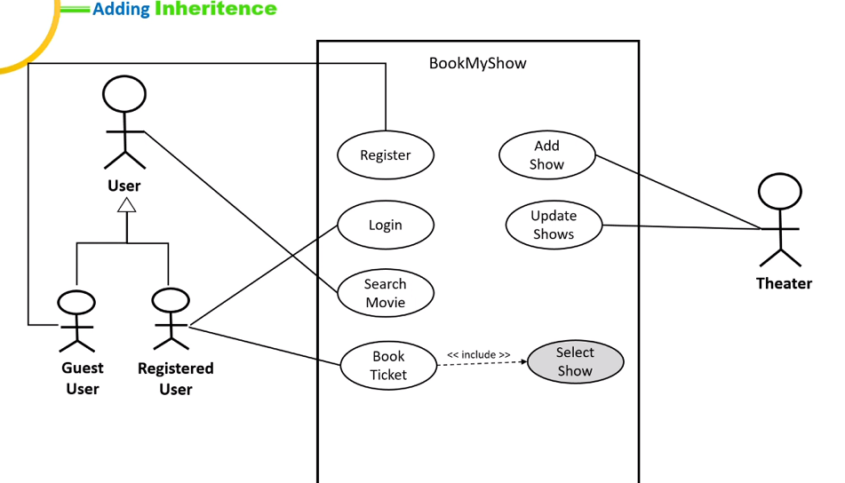
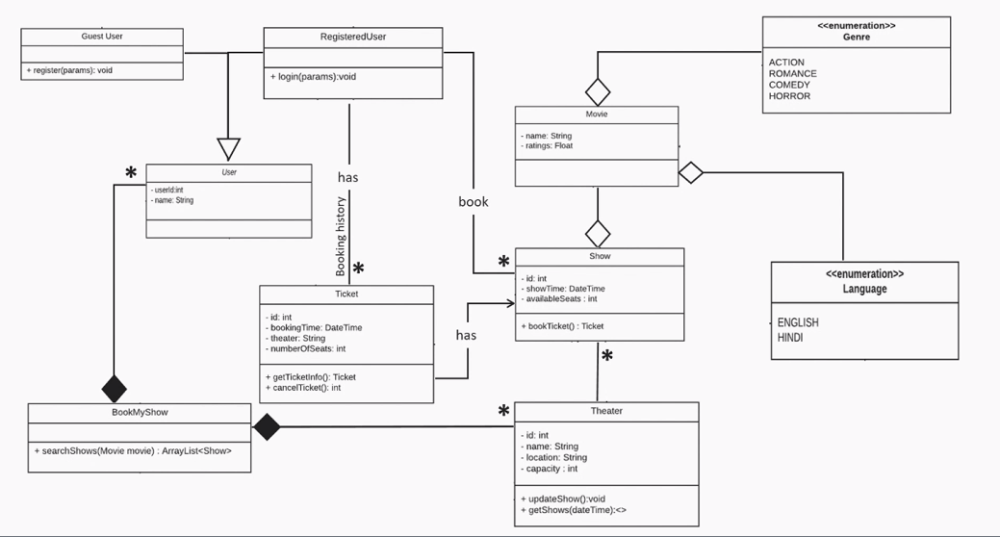

# BookMyShow

This application used to book shows, manage movies buy theaters 

## Requirements 

-  com.app.App show current shows and movies
-  com.app.App allow user to search for movies
-  Theater can manage shows 
-  com.app.App list different shows for a movie (Noon/matinee/first shows)
-  com.app.App allow registered user to book shows

## Assumptions 
- Every theater has single screen 
- Every theater has a capacity 
- Guest user can search, but only registered users can book a show
- Ticket will issues once booking is confirmed
- com.app.Movie can be in different languages (English, Malayalam, Hindi)
- Moview can be in different Genres (Action,Comedy,Thriller, horror)
- Payment integration is not part of MVP 

## Use case diagram

## Class diagrams 

Objects identified from requirements
 - com.app.App
 - Shows
 - com.app.User 
 - Movies 
 - Genres
 - Languages
 - tickets
 
 These are the relation 
  - App contains many users and theater
  - user can be registered/Guest 
  - com.app.Movie has com.app.Language and Genres 
  - Threater has many shows 
  - Each show has a movie 
  - Registered user can book a show, ticket issued to user 
  - com.app.User can have many booking/ticket 
  
 

  